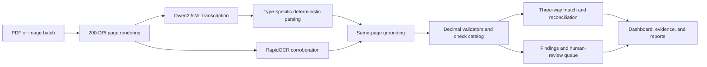

# TrustAudit V2

**An evidence-grounded AI finance controller for document audit, three-way matching, and payment reconciliation.**

TrustAudit V2 processes invoices, purchase orders, goods receipts, delivery challans, contracts, and certificates. A local vision model reads each page, deterministic parsers extract explicit facts, and Python validators make the financial decisions. Unreadable, unsupported, or weakly grounded documents are sent to review instead of being presented as passed.

> Primary submission: **V2 on port 8100**. The original V1 remains in this repository for provenance and comparison, but it is frozen.

## Why it fits AI Finance Controller

- Audits batches of trade and finance documents.
- Correlates invoices, purchase orders, and goods receipts for three-way matching.
- Reconciles payout, bank, and ledger records with an explicit exception list.
- Calculates money with Python `Decimal`; the vision model never decides arithmetic.
- Preserves page-level evidence, review decisions, contradictions, and decision fingerprints.
- Fails safely: incomplete evidence cannot produce a passing document.

## How it works



The default balanced cascade makes one Qwen transcription call for a clean page. A targeted structured-model request is used only for missing or ambiguous fields, and every returned value must still be grounded in the page transcription. Presentation summaries are deterministic by default; NVIDIA is optional for prose, cross-checking, and the on-demand copilot.

## Safety properties

| Property | Behaviour |
|---|---|
| Monetary decisions | Pure Python validators using `Decimal` |
| OCR/VLM claims | Must be supported by same-page transcription |
| Missing pages or failed extraction | `INCOMPLETE`, never `PASS` |
| Unrecognized document | `UNSUPPORTED`; no type-specific checks run |
| Ambiguous or conflicting evidence | `PENDING` and routed to human review |
| Model arithmetic | Ignored; expected totals are recomputed independently |
| Provenance | Evidence source, page, backend, model, and decision fingerprint retained |

## Evaluation evidence

The repository includes **210 synthetic, ground-truthed documents** under `evaluation/golden_set/`:

| Set | Documents |
|---|---:|
| Invoices | 140 |
| Purchase orders | 30 |
| Delivery challans | 15 |
| Goods receipt notes | 15 |
| Prompt-injection documents | 10 |

The checked-in deterministic baseline evaluates 200 financial documents and reports 1.00 precision, recall, and F1 for the exercised checks. This is a generated-domain benchmark, not a claim that OCR is perfect on arbitrary real documents. The application exposes incomplete extraction and review-required cases separately.

Run the benchmark:

```powershell
python evaluation/measure_v2.py --out evaluation/baselines/v2.json
```

Generate and validate a 60-record reconciliation batch:

```powershell
python generate_recon_batch.py --records 60 --seed 42 --out data/recon
python evaluation/evaluate_recon.py --batch data/recon
```

## Quick start: V2 demo on Windows

### Prerequisites

- Python 3.11 or newer
- Node.js and npm
- [Ollama](https://ollama.com/) with `qwen2.5vl:3b`
- Docker Desktop only if you want the durable Postgres, MinIO, and Temporal stack

Open the repository in VS Code and use separate PowerShell terminals.

### 1. Install the V2 backend

```powershell
python -m venv .venv-v2
Set-ExecutionPolicy -Scope Process Bypass
& .\.venv-v2\Scripts\Activate.ps1
python -m pip install --upgrade pip
python -m pip install -e ".\audit_v2[dev]"
Copy-Item .env.example .env -ErrorAction SilentlyContinue
```

### 2. Start local vision

```powershell
ollama pull qwen2.5vl:3b
ollama serve
```

On Windows, the Ollama desktop application may already run the service. If `ollama serve` says the address is in use, keep the existing service and continue.

### 3. Start the V2 API

```powershell
& .\.venv-v2\Scripts\Activate.ps1
python -m uvicorn audit_v2.server:app --host 127.0.0.1 --port 8100
```

Confirm [V2 health](http://127.0.0.1:8100/api/v2/health) or open the [API documentation](http://127.0.0.1:8100/docs).

### 4. Start the web interface

```powershell
Set-Location audit-frontend
npm install
npm run dev -- --host 127.0.0.1
```

Open [TrustAudit V2](http://127.0.0.1:5173/?mode=v2). Upload several related documents together to populate the dashboard and matching views.

### Optional durable services

The direct demo API can run with its in-memory stores. For Postgres, MinIO, and Temporal-backed development:

```powershell
docker compose up -d
python -m audit_v2.orchestration.worker
```

## Configuration

Copy `.env.example` to `.env`. Safe local defaults are already provided:

```dotenv
V2_VISION_BACKEND=qwen_ollama
QWEN_VL_BASE_URL=http://127.0.0.1:11434
QWEN_VL_MODEL=qwen2.5vl:3b
QWEN_VL_CONTEXT_LENGTH=4096
QWEN_VL_MAX_IMAGE_EDGE=1200
V2_EXTRACTION_POLICY=balanced
V2_CROSS_CHECK_MODE=on_review
V2_SUMMARY_MODE=deterministic
```

GLM-OCR through llama.cpp remains available by setting `V2_VISION_BACKEND=glm_ocr`. NVIDIA configuration is optional and never required for deterministic audit results. Never commit `.env` or API keys.

## Repository map

```text
audit_v2/                  V2 API, domain, extraction, pipeline and reporting
audit-frontend/            Shared React UI; open with ?mode=v2 for the submission
contracts/                 Versioned check catalog, routing rules and JSON schemas
evaluation/golden_set/     Synthetic PDFs plus one ground-truth manifest per document
evaluation/measure_v2.py   Deterministic document evaluation harness
reconcile/                 Payout/bank/ledger reconciliation engine
tests/                     Unit, regression, gateway and pipeline tests
docs/                      Architecture, design notes and implementation history
app/, backend/             Frozen V1 implementation
```

V1 and V2 intentionally coexist and are kept behind import boundaries: V2 must not import `app/` or `backend/`, and V1 must not import `audit_v2/`.

## Verification

```powershell
pytest -v
ruff check audit_v2
mypy --strict audit_v2/domain
npm --prefix audit-frontend run build
```

Schema and import-boundary checks are also available through `make validate-schemas` and `make import-lint` in environments with GNU Make.

## Current limitations

- OCR accuracy still depends on image quality, layout, and local model availability.
- The direct API stores audit results in memory; restart it to clear the demo corpus.
- Qwen requests are serialized to remain stable on a 6 GB GPU, so large image batches take time.
- Unusual or multilingual layouts may require human review.
- Full Temporal/Postgres integration tests require the Docker services.

See `shortcomings.md` for the complete, actively maintained limitations log and `tracker.md` for implementation history.
